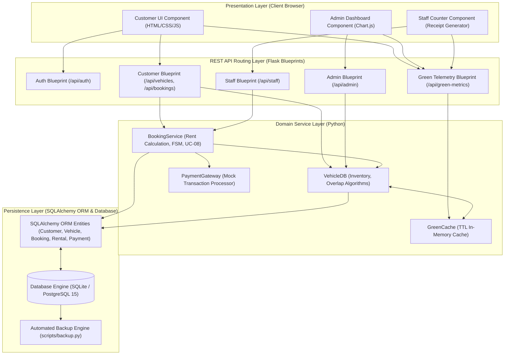

# 09. Component Diagram
**Project:** Vehicle Rental Management System (VRMS)  
**Lab:** Software Engineering Lab (CIC-357) | MAIT, GGSIPU Delhi  

---

## 1. System Component Architecture

```mermaid
flowchart TD
    subgraph Presentation_Layer ["Presentation Layer (Client Browser)"]
        UI_Customer["Customer UI Component (HTML/CSS/JS)"]
        UI_Admin["Admin Dashboard Component (Chart.js)"]
        UI_Staff["Staff Counter Component (Receipt Generator)"]
    end

    subgraph API_Layer ["REST API Routing Layer (Flask Blueprints)"]
        Route_Auth["Auth Blueprint (/api/auth)"]
        Route_Customer["Customer Blueprint (/api/vehicles, /api/bookings)"]
        Route_Admin["Admin Blueprint (/api/admin)"]
        Route_Staff["Staff Blueprint (/api/staff)"]
        Route_Green["Green Telemetry Blueprint (/api/green-metrics)"]
    end

    subgraph Domain_Service_Layer ["Domain Service Layer (Python)"]
        Svc_Booking["BookingService (Rent Calculation, FSM, UC-08)"]
        Svc_Vehicle["VehicleDB (Inventory, Overlap Algorithms)"]
        Svc_Gateway["PaymentGateway (Mock Transaction Processor)"]
        Svc_Cache["GreenCache (TTL In-Memory Cache)"]
    end

    subgraph Data_Layer ["Persistence Layer (SQLAlchemy ORM & Database)"]
        ORM["SQLAlchemy ORM Entities (Customer, Vehicle, Booking, Rental, Payment)"]
        DB_Engine[("Database Engine (SQLite / PostgreSQL 15)")]
        Backup_Engine["Automated Backup Engine (scripts/backup.py)"]
    end

    %% Layer Connections
    UI_Customer --> Route_Auth
    UI_Customer --> Route_Customer
    UI_Admin --> Route_Admin
    UI_Staff --> Route_Staff
    UI_Customer & UI_Admin & UI_Staff --> Route_Green

    Route_Customer --> Svc_Booking
    Route_Customer --> Svc_Vehicle
    Route_Admin --> Svc_Vehicle
    Route_Staff --> Svc_Booking
    Route_Green --> Svc_Cache

    Svc_Booking --> Svc_Vehicle
    Svc_Booking --> Svc_Gateway
    Svc_Vehicle <--> Svc_Cache

    Svc_Booking --> ORM
    Svc_Vehicle --> ORM
    ORM <--> DB_Engine
    DB_Engine --> Backup_Engine
```
